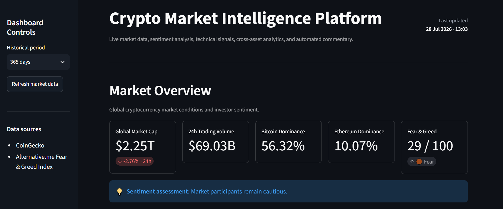
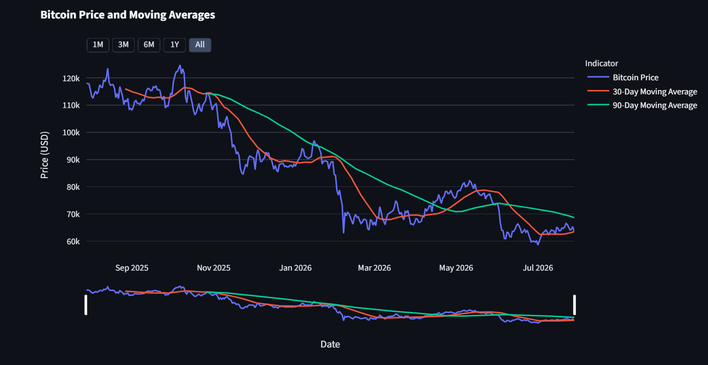
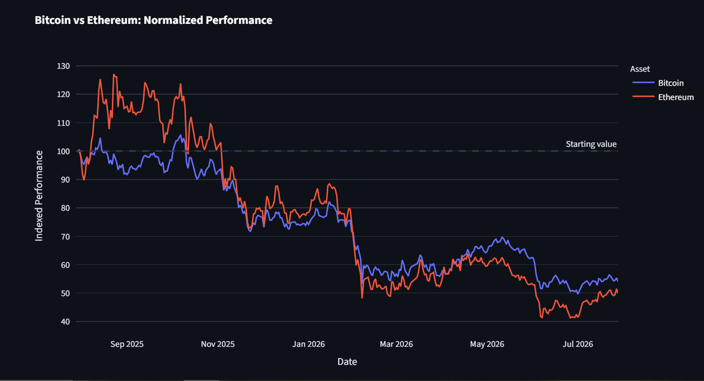
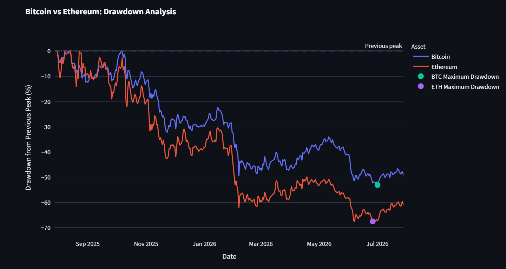
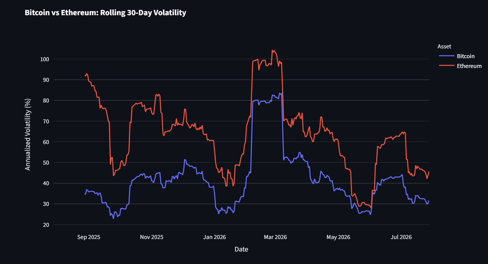

# 📈 Crypto Market Intelligence Platform


> An interactive cryptocurrency market analytics platform built with **Python**, **Streamlit**, and **Plotly** that transforms live market data into actionable financial insights.



## 🌐 Live Demo

[Open the Crypto Market Intelligence Platform](https://institutional-crypto-market-monitor-zhjzknmw7grq7r3zll8cwc.streamlit.app/)

## Overview

The **Crypto Market Intelligence Platform** is an end-to-end financial analytics project that retrieves live cryptocurrency market data and converts it into an interactive dashboard for market monitoring and analysis.

The platform combines historical price analysis, technical indicators, market sentiment, and risk metrics to provide a structured overview of the cryptocurrency market.

This project was developed to demonstrate practical applications of financial data analysis, Python programming, API integration, and dashboard development.

---

## Features

### 📊 Live Market Data

- Live Bitcoin & Ethereum prices
- Global cryptocurrency market capitalization
- 24-hour trading volume
- BTC & ETH market dominance
- Crypto Fear & Greed Index

### 📈 Technical Analysis

- Historical price analysis
- 30-day & 90-day moving averages
- Trend identification
- Momentum analysis
- Rolling annualized volatility
- Maximum drawdown analysis

### 📉 Risk Analytics

- Rolling volatility comparison
- Drawdown tracking
- Market risk indicators
- Trend and momentum signals

### 💡 Automated Market Intelligence

- Executive market summary
- Rule-based market commentary
- Market sentiment interpretation

### 📊 Interactive Dashboard

- Interactive Plotly visualizations
- Streamlit web application
- Historical period selection
- Responsive dashboard layout

---

# Dashboard Preview

## Market Overview


---

## Price Analysis



---

## Normalized Performance



---

## Maximum Drawdown



---

## Volatility Comparison



---

# Project Structure

```text
Crypto-Market-Intelligence-Platform/
│
├── app.py
├── data.py
├── analytics.py
├── visualizations.py
├── requirements.txt
├── README.md
├── .gitignore
│
├── notebook/
│   └── institutional_crypto_market_monitor.ipynb
│
├── screenshots/
│   ├── dashboard.png
│   ├── price_chart.png
│   ├── normalized_performance.png
│   ├── drawdown.png
│   └── volatility.png
│
└── .streamlit/
    └── secrets.toml.example
```

---

# Tech Stack

| Category | Technologies |
|----------|--------------|
| Language | Python |
| Data Analysis | Pandas, NumPy |
| Visualization | Plotly |
| Dashboard | Streamlit |
| APIs | CoinGecko API, Alternative.me Fear & Greed API |
| Environment | Jupyter Notebook, VS Code |
| Version Control | Git & GitHub |

---

# Financial Metrics

The dashboard calculates several commonly used market analytics:

- Historical Returns
- Moving Averages (30 & 90 Day)
- Daily Returns
- Rolling Annualized Volatility
- Maximum Drawdown
- Trend Signal
- Momentum Signal
- Risk Signal
- Market Sentiment Indicator

---

# Data Sources

- CoinGecko API
- Alternative.me Crypto Fear & Greed Index

---

# Installation

Clone the repository

```bash
git clone https://github.com/YOUR_USERNAME/Crypto-Market-Intelligence-Platform.git
```

Move into the project directory

```bash
cd Crypto-Market-Intelligence-Platform
```

Install dependencies

```bash
pip install -r requirements.txt
```

Run the Streamlit application

```bash
streamlit run app.py
```

---

# Future Improvements

- Sharpe Ratio
- Sortino Ratio
- Rolling BTC–ETH Correlation
- Value at Risk (VaR)
- Portfolio Analytics
- Additional Cryptocurrency Support
- AI-generated Market Commentary
- Cloud Deployment

---

# Disclaimer

This project was developed for educational and portfolio purposes only and does not constitute investment advice.

---

# Author

**Franca Marlene Liz Schellhorn**

Finance | Python | Financial Modeling | Data Analytics

LinkedIn: *(https://www.linkedin.com/in/lizschellhorn-finance/)*

GitHub: *(https://github.com/Liz-Schellhorn)*